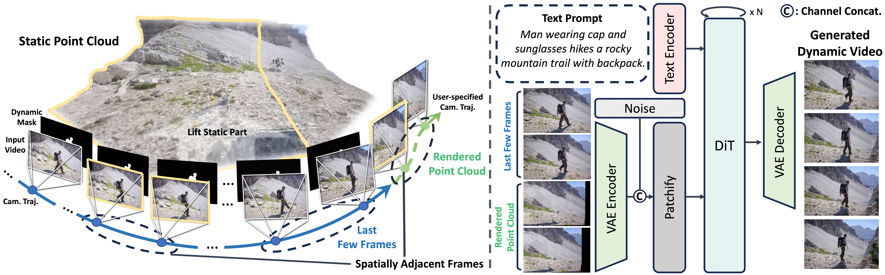

# 3D Scene Prompting for Scene-Consistent Camera-Controllable Video Generation
<a href="https://arxiv.org/abs/2510.14945"></a>
<a href="https://cvlab-kaist.github.io/3DScenePrompt"></a>  
<br>

This is the official implementation of the paper  
**"3D Scene Prompting for Scene-Consistent Camera-Controllable Video Generation"**

by [**Joungbin Lee**](https://scholar.google.com/citations?user=0H3dcPoAAAAJ&hl=en)<sup>1\*</sup> · 
[**Jaewoo Jung**](https://crepejung00.github.io/)<sup>1\*</sup> · 
[**Jisang Han**](https://onground-korea.github.io/)<sup>1\*</sup> · 
[**Takuya Narihira**](https://scholar.google.com/citations?user=D3h3NxwAAAAJ&hl=en)<sup>2</sup> · 
[**Kazumi Fukuda**](https://ai.sony/people/Kazumi-Fukuda/)<sup>2</sup> · 
[**Junyoung Seo**](https://j0seo.github.io/)<sup>1</sup> · 
[**Sunghwan Hong**](https://sunghwanhong.github.io/)<sup>3</sup> · 
[**Yuki Mitsufuji**](https://www.yukimitsufuji.com/)<sup>2,4&dagger;</sup> · 
[**Seungryong Kim**](https://cvlab.kaist.ac.kr/members/faculty)<sup>1&dagger;</sup>  

<sup>1</sup>KAIST AI&emsp;&emsp;&emsp;&emsp;
<sup>2</sup>Sony AI&emsp;&emsp;&emsp;&emsp;
<sup>3</sup>ETH Zürich&emsp;&emsp;&emsp;&emsp;
<sup>4</sup>Sony Group Corporation 

*: Co-First Author <br>
&dagger;: Co-Corresponding Author

---

## Introduction
  

**3DScenePrompt** is a framework to generate a **next chunk video** from any **arbitrary-length** in-the-wild input video while allowing precise **camera control** and maintaining **scene-consistency** with the input video.


## 🚀 ToDo
- [x] Pretrained weights. <br>
- [x] Inference code. <br>
- [ ] CogVideoX training code. <br>
- [ ] WAN 2.1 training & inference code. <br>
- [ ] Evaluation code <br>
- [ ] Visualization code <br>

---

## Installation
Our code is developed based on pytorch 2.5.1, CUDA 12.1 and python 3.10.

```bash
git clone --recursive https://github.com/cvlab-kaist/3DScenePrompt.git
cd 3DScenePrompt

conda create -n 3DScenePrompt python=3.10
conda activate 3DScenePrompt

pip install torch==2.5.1 torchvision==0.20.1 torchaudio==2.5.1 xformers --index-url https://download.pytorch.org/whl/cu121
pip install --extra-index-url https://miropsota.github.io/torch_packages_builder pytorch3d==0.7.8+pt2.5.1cu121

cd Depth-Anything-3
pip install -e . 

cd third_party/sam2
pip install -e .
cd ../../../

pip install -r requirements.txt
```

## Running Demo

### Data Preprocessing
This project provides a preprocessing pipeline that converts input videos into depth maps, normal maps, conditioning videos, and additional metadata required for training and inference.
Run the following script to generate the dataset:

```bash
cd Depth-Anything-3
bash data_preprocesisng.sh
cd ../
```

After running the preprocessing script, the dataset will be structured as follows:

```
dataset
├── images
│   ├── {scene_name}
│   │   ├── color
│   │   │   ├── 000000.jpg
│   │   │   ├── 000001.jpg
│   │   │   ├── ...
│   │   │   ├── 000100.jpg
│   │   │
│   │   └── DA3.npz              # Depth-Anything-3 depth + normal + confidence
│   │
│   └── ...
│
├── cond_video
│   ├── {scene_name}.mp4         # conditioning video
│   └── ...
│
├── captions.txt                 # caption per scene
├── cond_video.txt               # path list of cond videos
├── continuous_video.txt         # continuous reconstructed video paths
```

### Inference

```bash
cd Spatio-CogVideo/inference
bash data_preprocessing.sh
```


---

## Citation
If you find this research useful, please consider citing:
```bibtex
@misc{lee20253dscenepromptingsceneconsistent,
      title={3D Scene Prompting for Scene-Consistent Camera-Controllable Video Generation}, 
      author={JoungBin Lee and Jaewoo Jung and Jisang Han and Takuya Narihira and Kazumi Fukuda and Junyoung Seo and Sunghwan Hong and Yuki Mitsufuji and Seungryong Kim},
      year={2025},
      eprint={2510.14945},
      archivePrefix={arXiv},
      primaryClass={cs.CV},
      url={https://arxiv.org/abs/2510.14945}, 
}
