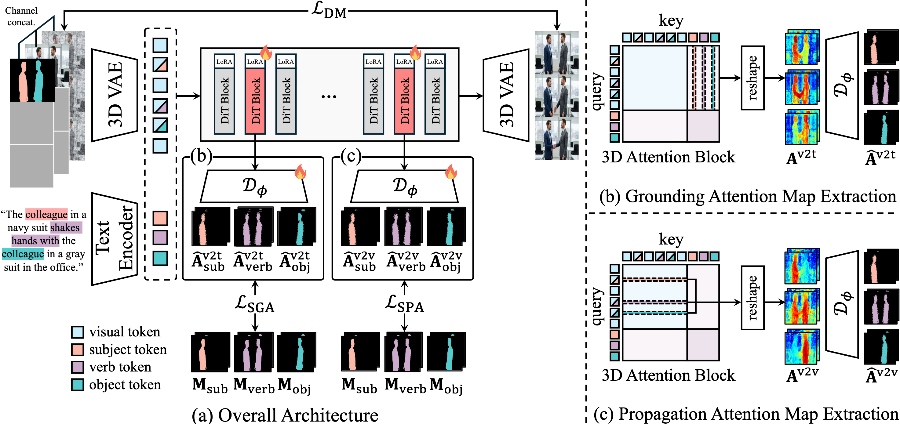

# 3D Scene Prompting for Scene-Consistent Camera-Controllable Video Generation
<a href="https://arxiv.org/abs/2510.14945"></a>
<a href="https://cvlab-kaist.github.io/3DScenePrompt"></a>  
<br>

This is the official implementation of the paper  
**"3D Scene Prompting for Scene-Consistent Camera-Controllable Video Generation"**

by [**Joungbin Lee**](https://scholar.google.com/citations?user=0H3dcPoAAAAJ&hl=en)<sup>1\*</sup> · 
[**Jaewoo Jung**](https://crepejung00.github.io/)<sup>1\*</sup> · 
[**Jisang Han**](https://onground-korea.github.io/)<sup>1\*</sup> · 
[**Takuya Narihira**](https://scholar.google.com/citations?user=D3h3NxwAAAAJ&hl=en)<sup>2</sup> · 
[**Kazumi Fukuda**](https://ai.sony/people/Kazumi-Fukuda/)<sup>2</sup> · 
[**Junyoung Seo**](https://j0seo.github.io/)<sup>1</sup> · 
[**Sunghwan Hong**](https://sunghwanhong.github.io/)<sup>3</sup> · 
[**Yuki Mitsufuji**](https://www.yukimitsufuji.com/)<sup>2,4&dagger;</sup> · 
[**Seungryong Kim**](https://cvlab.kaist.ac.kr/members/faculty)<sup>1&dagger;</sup>  

<sup>1</sup>KAIST AI&emsp;&emsp;&emsp;&emsp;
<sup>2</sup>Sony AI&emsp;&emsp;&emsp;&emsp;
<sup>3</sup>ETH Zürich&emsp;&emsp;&emsp;&emsp;
<sup>4</sup>Sony Group Corporation 

*: Co-First Author <br>
&dagger;: Co-Corresponding Author

---

## Introduction
  

**3DScenePrompt** is a framework to generate a **next chunk video** from any **arbitrary-length** in-the-wild input video while allowing precise **camera control** and maintaining **scene-consistency** with the input video.

---

## Code and Models
The source code and pretrained weights will be released soon.  
Stay tuned for updates!

---

## Citation
If you find this research useful, please consider citing:
```bibtex
@misc{lee20253dscenepromptingsceneconsistent,
      title={3D Scene Prompting for Scene-Consistent Camera-Controllable Video Generation}, 
      author={JoungBin Lee and Jaewoo Jung and Jisang Han and Takuya Narihira and Kazumi Fukuda and Junyoung Seo and Sunghwan Hong and Yuki Mitsufuji and Seungryong Kim},
      year={2025},
      eprint={2510.14945},
      archivePrefix={arXiv},
      primaryClass={cs.CV},
      url={https://arxiv.org/abs/2510.14945}, 
}
